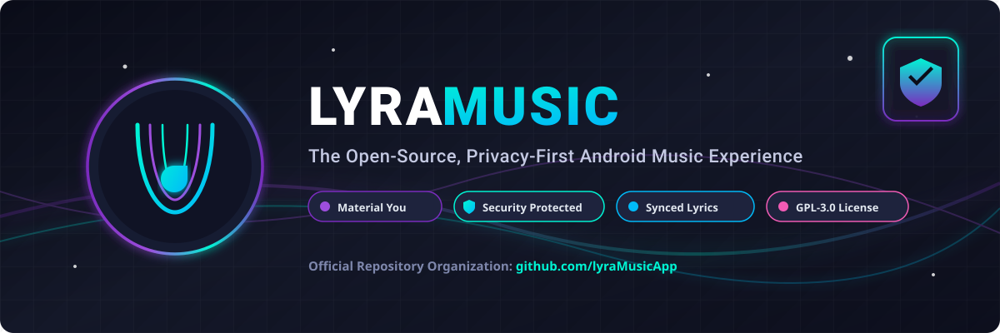

<p align="center">
  
</p>

<h1 align="center">Lyra Music</h1>

<p align="center">
  <b>The Open-Source, Privacy-First Android Music Experience</b>
</p>

<p align="center">
  <a href="https://github.com/lyraMusicApp/lyra-music/releases/latest">
    
  </a>
  <a href="SECURITY.md">
    
  </a>
  <a href="LICENSE">
    
  </a>
  
  
</p>

---

## 🌟 Overview

**Lyra Music** is a modern, high-performance Android music streaming and offline playback application developed under the **[lyraMusicApp](https://github.com/lyraMusicApp)** organization. Built with **Jetpack Compose** and **Material You dynamic design**, Lyra Music focuses on delivering a sleek, seamless, and privacy-hardened music experience without invasive telemetry, ads, or tracking.

---

## ✨ Key Features

- 🔍 **Universal Search**: Discover songs, albums, artists, playlists, and videos.
- 🎨 **Material You Interface**: Fluid animations, dynamic color themes, and responsive design for phone, tablet, and Android Auto.
- 🎵 **Spotify Playlist Import**: Import tracks from public Spotify playlist links via **Settings > Backup & Restore**.
- 🎤 **Synchronized Lyrics**: Real-time synchronized lyrics rendering with customizable fonts and smooth scrolling.
- 💾 **Offline Downloads**: High-fidelity offline audio downloading and local playlist caching.
- 🛡️ **Privacy & Safety First**: Zero ad tracking, zero telemetry keylogging, encrypted local caches, and private sandbox storage.
- 🔊 **Advanced Audio Engine**: Equalizer support, fast audio buffering, gapless playback, background service control, and Android media notification integration.

---

## 📲 Download & Verification

Download official, verified release builds from the **[Releases](https://github.com/shnwazdeveloper/lyraMusic/releases)** page.

- **Package Name**: `com.shnwazdeveloper.lyramusic`
- **Build Type**: Signed Release APK (APK Signature Scheme v2 & v3 verified).

### 🔐 SHA-256 Checksum Verification
To verify your downloaded APK file integrity:

```powershell
Get-FileHash -Algorithm SHA256 .\lyraMusic.apk
```

---

## 🛡️ Security & Community Protection

Lyra Music takes security and community safety seriously:

- **Security Policy**: Read our [SECURITY.md](SECURITY.md) for vulnerability disclosure SLAs and private reporting instructions.
- **Code of Conduct**: Standardized under the [Contributor Covenant v2.1](CODE_OF_CONDUCT.md).
- **Automated Security Audit**: Scans via Dependabot and GitHub Actions Security Workflows.

---

## 🛠️ Build From Source

### Prerequisites
- Android Studio Ladybug or newer
- Android SDK (API 34+)
- JDK 21

### Local Build Command

```powershell
# Windows PowerShell
.\gradlew.bat :app:packageUniversalRelease
```

Generated APK path:
```text
app/build/outputs/apk/universal/release/lyraMusic.apk
```

---

## 🌐 Official Organization Links

- 🏛️ **Organization Portal**: [github.com/lyraMusicApp](https://github.com/lyraMusicApp)
- 🚀 **Main Repository**: [github.com/shnwazdeveloper/lyraMusic](https://github.com/shnwazdeveloper/lyraMusic)
- 🐛 **Issue & Security Tracker**: [github.com/shnwazdeveloper/lyraMusic/issues](https://github.com/shnwazdeveloper/lyraMusic/issues)
- 📢 **Maintainer Telegram**: [@sexyafraid](https://t.me/sexyafraid)

---

## 📜 License & Credits

Lyra Music is licensed under the **GNU General Public License v3.0 (GPL-3.0)**. See [LICENSE](LICENSE) for details.

Based on open-source contributions from OpenTune by Arturo254.
